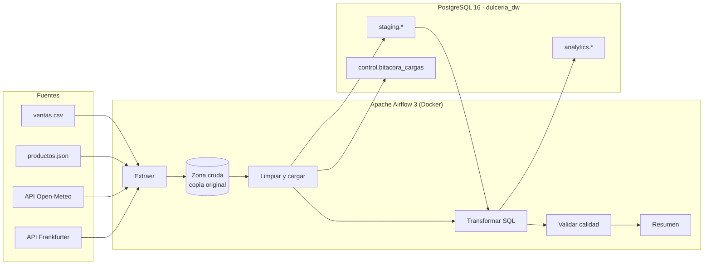

# Pipeline ETL con Apache Airflow y PostgreSQL — Dulcería Premium

Pipeline de datos que **junta 4 fuentes distintas** (CSV, JSON y 2 APIs REST),
las limpia, las combina en un **data warehouse PostgreSQL** y se ejecuta **solo,
todos los días**, orquestado por **Apache Airflow 3**. Todo corre en **Docker**.

Caso de negocio: la tienda en línea [Dulcería Premium](https://kevinislas1595.github.io/sistema-inventario/)
quiere saber cuánto vende por día y por producto, cuánto es eso en dólares y si
el clima (la lluvia) cambia las ventas.


---

## Las 4 fuentes

| # | Fuente | Tipo | Qué trae | Cómo se carga |
|---|--------|------|----------|---------------|
| 1 | [`data/entrada/ventas.csv`](data/entrada/ventas.csv) | Archivo CSV | ~1,200 renglones de ventas (pedido, producto, cantidad, precio, canal) | Completa, upsert por `(folio, producto_id)` |
| 2 | [`data/entrada/productos.json`](data/entrada/productos.json) | Archivo JSON | Catálogo: 13 gomitas Lucky con marca, tipo y precio | Completa, upsert por `producto_id` |
| 3 | [Open-Meteo](https://open-meteo.com/) | API REST | Temperatura máxima/mínima y lluvia diaria en CDMX | **Incremental** por fecha |
| 4 | [Frankfurter](https://frankfurter.dev/) (Banco Central Europeo) | API REST | Tipo de cambio USD → MXN | **Incremental** por fecha |

Las dos APIs son públicas y no necesitan API key.

> Los precios y productos son los de la tienda; **las ventas son simuladas** y traen
> errores a propósito (precios con `$`, fechas `dd/mm/aaaa`, canales en mayúsculas,
> renglones duplicados, cantidades vacías) para demostrar la limpieza.

## Arquitectura



### El DAG `etl_dulceria_premium`

Corre **diario a las 7:00 a.m.** (hora de CDMX). Las 4 fuentes se procesan **en paralelo**:

```
preparar_tablas ─┬─ ventas_csv      [extraer → cargar] ─┬─ transformar → validar_calidad → resumen
                 ├─ productos_json  [extraer → cargar] ─┤
                 ├─ clima_api       [extraer → cargar] ─┤
                 └─ tipo_cambio_api [extraer → cargar] ─┘
```

| Tarea | Qué hace |
|-------|----------|
| `preparar_tablas` | Crea esquemas, tablas y vistas si no existen ([`sql/00_esquema.sql`](sql/00_esquema.sql)) |
| `*.extraer` | Lee el archivo o llama a la API y **guarda la respuesta original** en la zona cruda |
| `*.cargar` | Limpia y valida fila por fila ([`limpieza.py`](dags/dulceria/limpieza.py)), hace upsert a `staging` y lo anota en la bitácora |
| `transformar` | Combina las 4 fuentes en el modelo de análisis ([`sql/transformar.sql`](sql/transformar.sql)) |
| `validar_calidad` | 11 reglas de calidad ([`calidad.py`](dags/dulceria/calidad.py)); si falla una obligatoria, el DAG se detiene |
| `resumen` | Escribe en el log los totales, los últimos 7 días y el top de productos |

## Buenas prácticas aplicadas

- **Idempotente:** correr el DAG dos veces no duplica nada (todo es `INSERT ... ON CONFLICT DO UPDATE`).
- **Carga incremental:** las APIs solo se consultan desde la última fecha guardada
  (menos 7 días, por si corrigieron datos recientes). La primera vez trae todo el histórico.
- **Zona cruda:** se guarda lo que llegó de cada fuente antes de transformarlo.
- **Capas:** `staging` (datos limpios por fuente) → `analytics` (modelo dimensional) → vistas de reporte.
- **Limpieza con motivo:** cada fila rechazada queda en el log con su número de línea y la razón.
- **Bitácora:** `control.bitacora_cargas` registra filas leídas, rechazadas, duplicadas y cargadas por corrida.
- **Calidad de datos:** reglas obligatorias (detienen el pipeline) y de aviso.
- **Reintentos:** 2 reintentos en tareas que pueden fallar por red; ninguno en la validación.
- **Tipo de cambio en fin de semana:** se usa el del último día hábil anterior.
- **DAG delgado:** la lógica vive en [`dags/dulceria/`](dags/dulceria/) y se prueba sin levantar Airflow.
- **Pruebas automáticas** de limpieza y de la estructura del DAG ([`tests/`](tests/)).

## Modelo de datos

| Esquema | Tabla / vista | Contenido |
|---------|---------------|-----------|
| `staging` | `ventas`, `productos`, `clima`, `tipo_cambio` | Una tabla por fuente, ya limpia |
| `analytics` | `dim_producto` | Catálogo |
| `analytics` | `dim_clima` | Clima por día y si fue lluvioso (≥ 1 mm) |
| `analytics` | `fact_ventas` | Cada venta con día de la semana, total en MXN, tipo de cambio y total en USD |
| `analytics` | `reporte_diario` *(vista)* | Pedidos, piezas, ingresos MXN/USD y clima por día |
| `analytics` | `ventas_por_producto` *(vista)* | Ranking de productos |
| `analytics` | `ventas_segun_lluvia` *(vista)* | Promedio diario con y sin lluvia |
| `control` | `bitacora_cargas` | Historial de cada carga |

---

## Cómo correrlo

### 1. Requisitos

- [Docker Desktop](https://www.docker.com/products/docker-desktop/) (en Windows necesita WSL 2; el instalador lo configura).
- Al menos **4 GB de RAM** asignados a Docker.

### 2. Levantar todo

```bash
git clone https://github.com/KevinIslas1595/pipeline-etl-airflow.git
cd pipeline-etl-airflow
docker compose up -d
```

La primera vez descarga las imágenes y tarda unos minutos. Para ver si ya está listo:

```bash
docker compose ps
```

Cuando `airflow-apiserver` diga `healthy`, ya se puede entrar.

### 3. Entrar

| Qué | Dirección | Usuario | Contraseña |
|-----|-----------|---------|------------|
| Airflow | http://localhost:8080 | `airflow` | `airflow` |
| Adminer (ver la base de datos en el navegador) | http://localhost:8081 | `dulceria` | `dulceria` |
| PostgreSQL desde DBeaver / pgAdmin | `localhost:5433`, base `dulceria_dw` | `dulceria` | `dulceria` |

En Adminer elige **Sistema: PostgreSQL**, servidor `postgres-dw` y base `dulceria_dw`.

El DAG `etl_dulceria_premium` aparece **encendido**: se ejecuta solo a las 7:00 a.m.
Para correrlo en ese momento, en Airflow presiona **▶ Trigger**.

### 4. Consultas de ejemplo

```sql
-- Ventas de los últimos 7 días con clima
SELECT * FROM analytics.reporte_diario ORDER BY fecha DESC LIMIT 7;

-- Productos más vendidos
SELECT nombre, piezas, ingreso_mxn FROM analytics.ventas_por_producto ORDER BY ingreso_mxn DESC;

-- ¿Se vende más cuando llueve?
SELECT * FROM analytics.ventas_segun_lluvia;

-- Historial de cargas
SELECT run_id, fuente, filas_leidas, filas_rechazadas, filas_duplicadas, filas_cargadas, cargado_en
FROM control.bitacora_cargas ORDER BY id DESC;
```

### 5. Pruebas

```bash
docker compose run --rm airflow-cli python -m unittest discover -s /opt/airflow/tests -v
```

### 6. Apagar

```bash
docker compose down      # apaga; los datos se conservan
docker compose down -v   # apaga y borra TODOS los datos (empezar de cero)
```

### Agregar datos nuevos

Agrega renglones a `data/entrada/ventas.csv` o productos a `data/entrada/productos.json`:
la siguiente corrida los toma automáticamente.

---

## Ejemplo de resultado

Log de la tarea `resumen` con los datos de ejemplo:

```
Pedidos: 529 | piezas: 2416 | ingreso: $189075.60 MXN (≈ $10964.85 USD) | del 2026-06-16 al 2026-09-13
Día 2026-09-13 Domingo   pedidos=5 piezas=19 $1464.20 MXN ($86.26 USD) temp=22.9°C lluvia=3.5 mm
Día 2026-09-12 Sábado    pedidos=7 piezas=38 $2973.30 MXN ($175.17 USD) temp=23.3°C lluvia=32.3 mm
Top producto: Ositos — 250 piezas, $20200.00 MXN
Con lluvia: 78 días, 6.0 pedidos/día, $2129.79 MXN/día
Sin lluvia: 12 días, 5.3 pedidos/día, $1912.63 MXN/día
```

Y de la carga del CSV (limpieza):

```
[ventas_csv] fila rechazada (607): cantidad vacío
[ventas_csv] fila rechazada (850): cantidad debe ser mayor a 0: 0
[ventas_csv] fila rechazada (1092): precio_unitario no es una cantidad: 'pendiente'
[ventas_csv] leídas=1213 rechazadas=3 duplicadas=2 cargadas=1208
```

## Estructura del proyecto

```
pipeline-etl-airflow/
├── docker-compose.yml        Airflow 3 + PostgreSQL (Airflow y warehouse) + Adminer
├── dags/
│   ├── etl_dulceria.py       El DAG: solo ordena las tareas
│   └── dulceria/
│       ├── config.py         Rutas, URLs de las APIs, conexión
│       ├── extraer.py        E: leer archivos / llamar APIs → zona cruda
│       ├── limpieza.py       Validar y normalizar fila por fila
│       ├── db.py             L: upsert, consultas, bitácora
│       ├── pasos.py          Lo que hace cada tarea
│       └── calidad.py        Reglas de calidad de datos
├── sql/
│   ├── 00_esquema.sql        Tablas y vistas
│   └── transformar.sql       T: staging → analytics
├── data/entrada/             Fuentes CSV y JSON
└── tests/                    Pruebas (unittest)
```
